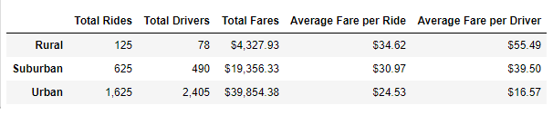
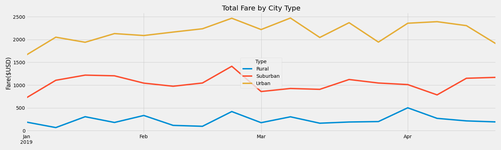

# PyBer Analysis: A graphical depiction of the fares for ride-sharing data in different geographical areas from January through April of 2019.

## Overview
The CEO at PyBer wants to increase the availability of the company’s services.  I have been tasked with performing an analysis and creating graphs to show the relationships between the number of drivers and average fares by city type and the total fare by city type.

## Analysis
Analysis was performed in Jupyter Notebook with Python 3.7 using libraries to assist in calculation. In the total fare by city type analysis the data was limited to January through April 2019. The data was then grouped by week. 

## Results
**Table 1:** Drivers and fares by city type.  The most drivers are in urban cities while the fewest are in rural cities.  The average fare per ride is lowest in the urban cities and highest in the rural cities.  

**Figure 1**:   Total Fare per month by city type for the first four months of 2019. The total fare amount was highest for urban cities and lowest for rural cities. There is not great variability in fare prices from month to month.

## Summary
One of the most striking differences I noticed was the disparity in the fares per driver. The rural fares are much higher than the urban fares. This must be because the distances they travel are so much greater, thus generating more money per trip. It seems the urban drivers may be spending less of their working day driving passengers than the rural drivers. Could it be because there are too many urban drivers and they are in too much competition for fares with each other? More research would need to be done to find out. If the result of further analysis reveals that there are too many urban drivers some of them could be transferred to the rural setting. It seems in these communities they may have unmet demand.

